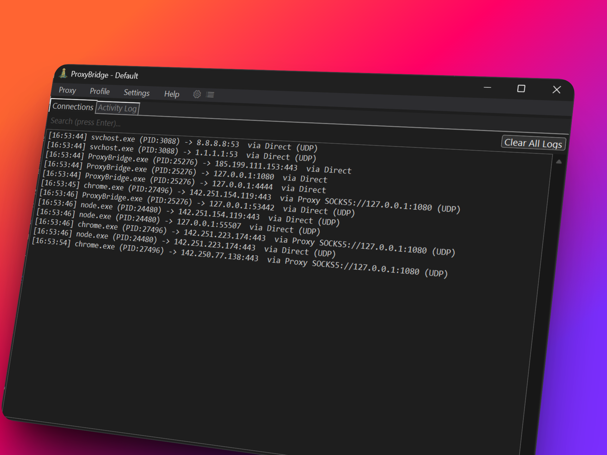
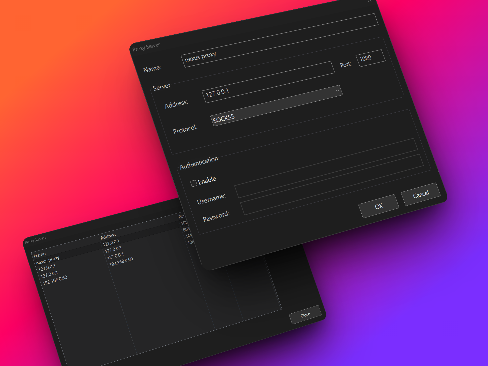
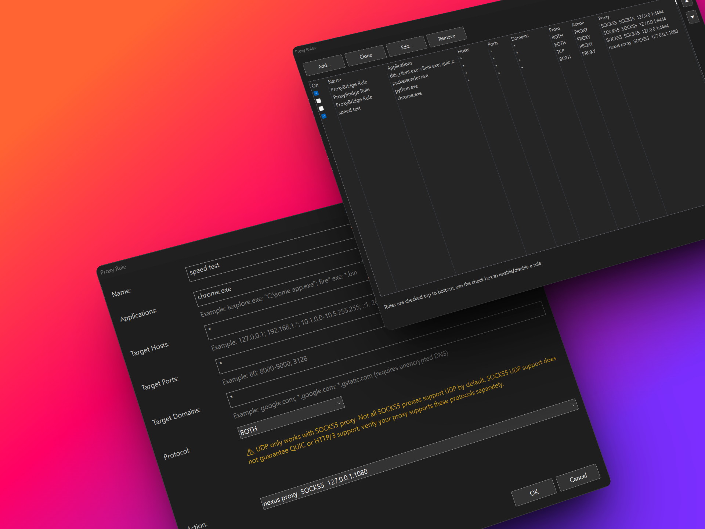

# ProxyBridge

<p align="center">
  
</p>

<p align="center">
  <a href="https://github.com/InterceptSuite/ProxyBridge/actions/workflows/build-windows.yml"></a>
  <a href="https://github.com/InterceptSuite/ProxyBridge/actions/workflows/build-mac.yml"></a>
  <a href="https://github.com/InterceptSuite/ProxyBridge/actions/workflows/build-linux.yml"></a>
  <a href="https://github.com/InterceptSuite/ProxyBridge/releases"></a>
</p>

<p align="center">
  <a href="https://trendshift.io/repositories/19916?utm_source=trendshift-badge&amp;utm_medium=badge&amp;utm_campaign=badge-trendshift-19916" target="_blank" rel="noopener noreferrer"></a>
  &nbsp;
  <a href="https://trendshift.io/repositories/19916?utm_source=trendshift-badge&amp;utm_medium=badge&amp;utm_campaign=badge-trendshift-19916" target="_blank" rel="noopener noreferrer"></a>
</p>

ProxyBridge is a lightweight, open-source universal proxy client (Proxifier alternative) that provides transparent proxy routing for applications on **Windows**, **macOS**, and **Linux**. It redirects TCP and UDP traffic from specific processes through SOCKS5 or HTTP proxies, with the ability to route, block, or allow traffic on a per-application basis. ProxyBridge fully supports both TCP and UDP proxy routing and works at the system level, making it compatible with proxy-unaware applications without requiring any configuration changes.

> [!TIP]
> **ProxyBridge routes your traffic - [InterceptSuite](https://interceptsuite.com) lets you see inside it.**
> Full MITM proxy with SSL/TLS inspection, live request editing, scripting, and support for TCP, UDP, StartTLS, DTLS and more. Built by the same team. [**Try InterceptSuite →**](https://interceptsuite.com)

## Table of Contents

- [ProxyBridge](#proxybridge)
  - [Table of Contents](#table-of-contents)
  - [Download](#download)
    - [🌐 Official Download Portal](#-official-download-portal)
    - [📦 Release Packages](#-release-packages)
      - [Linux One-Command Quick Install:](#linux-one-command-quick-install)
  - [Features](#features)
  - [Documentation](#documentation)
  - [Screenshots](#screenshots)
    - [macOS](#macos)
    - [Windows](#windows)
      - [GUI](#gui)
      - [CLI](#cli)
    - [Linux](#linux)
      - [GUI](#gui-1)
      - [CLI](#cli-1)
  - [Use Cases](#use-cases)
  - [InterceptSuite](#interceptsuite)
  - [License](#license)
  - [Author](#author)
  - [Credits](#credits)

<p align="center">
  <strong>💖 Support ProxyBridge Development</strong><br/>
  <em>If you find ProxyBridge useful, consider sponsoring to support ongoing development and new features!</em><br/><br/>
  <a href="https://github.com/sponsors/InterceptSuite">
    
  </a>
</p>

## Download

### 🌐 Official Download Portal
Visit our **[Official Download Page](https://interceptsuite.com/download/proxybridge)** for the latest automated builds and platform detection.

### 📦 Release Packages

| Platform | Download Link | Package Type | System Requirements |
| :--- | :--- | :--- | :--- |
| **Windows** | [**Download Installer**](https://interceptsuite.com/download/proxybridge) | `.exe` | Windows 10+ (64-bit), Admin privileges |
| **macOS** | [**Download Installer**](https://interceptsuite.com/download/proxybridge) | `.pkg` (Universal) | macOS 13.0+ ARM/x64 (Ventura or later) |
| **Linux** | [**Download Tarball**](https://interceptsuite.com/download/proxybridge) | `.tar.gz` | x64 Kernel with NFQUEUE support |

#### Linux One-Command Quick Install:
```bash
curl -Lo deploy.sh https://raw.githubusercontent.com/InterceptSuite/ProxyBridge/refs/heads/master/Linux/deploy.sh && sudo bash deploy.sh
```

#### Windows via winget:
```powershell
winget install InterceptSuite.ProxyBridge
```

> [!WARNING]
> The winget package is **community-maintained and not official**. It may lag behind releases or be unverified. For guaranteed-latest, verified builds always use the [Official Download Page](https://interceptsuite.com/download/proxybridge).

> [!NOTE]
> For historical versions, change logs, and direct access to raw assets, visit the [GitHub Releases](https://github.com/InterceptSuite/ProxyBridge/releases) page.

## Features

- **Cross-platform** - Available for Windows, macOS and Linux
- **Dual interface** - Feature-rich GUI and powerful CLI for all use cases
- **Process-based traffic control** - Route, block, or allow traffic for specific applications
- **Universal compatibility** - Works with proxy-unaware applications
- **Multiple proxy protocols** - Supports SOCKS5 and HTTP proxies
- **System-level interception** - Reliable packet capture at kernel/network extension level
- **No configuration needed** - Applications work without any modifications
- **Protocol agnostic** - Compatible with TCP and UDP protocols (HTTP/HTTPS, HTTP/3, databases, RDP, SSH, games, DTLS, DNS, etc.)
- **Traffic blocking** - Block specific applications from accessing the internet or any network (LAN, localhost, etc.)
- **Flexible rules** - Direct connection, proxy routing, or complete blocking per process
- **Advanced rule configuration** - Target specific processes, IPs, ports, protocols (TCP/UDP), and hostnames with wildcard support - full IPv4 and IPv6 support on Windows
- **Process exclusion** - Prevent proxy loops by excluding proxy applications
- **Import/Export rules** - Share rule configurations across systems with JSON-based import/export

> [!CAUTION]
> **Beware of Fake ProxyBridge Downloads**
>
> Multiple **fake ProxyBridge download sources** have been identified. Some of these sources distribute **unwanted binaries** and **malicious software**.
>
> ❌ **Do NOT download ProxyBridge from any third-party or unofficial sources.**
>
> ✅ **Official ProxyBridge sources (only):**
> - GitHub Repository: https://github.com/InterceptSuite/ProxyBridge/
> - Official Website: [https://interceptsuite.com/download/proxybridge](https://interceptsuite.com/download/proxybridge)
>
> If you prefer not to use prebuilt binaries, you may safely build ProxyBridge yourself by following the **Contribution Guide** and compiling directly from the **official source code**.
>
> ProxyBridge does not communicate with any external servers except the GitHub API for update checks (triggered only on app launch or manual update checks);


## Documentation

> [!IMPORTANT]
> **[📖 Full Documentation](https://interceptsuite.com/docs/proxybridge/)**
>
> Everything you need to get started and go deep:
> - Installation and setup guides
> - Proxy rules and rule configuration
> - CLI reference
> - UDP, IPv6, HTTP/3, DTLS setup
> - Troubleshooting and advanced usage
>
> **[interceptsuite.com/docs/proxybridge](https://interceptsuite.com/docs/proxybridge/)**

## Screenshots

### macOS

<p align="center">
  
  <br/>
  <em>ProxyBridge GUI - Main Interface</em>
</p>

<p align="center">
  
  <br/>
  <em>Proxy Settings Configuration</em>
</p>

<p align="center">
  
  <br/>
  <em>Proxy Rules Management</em>
</p>

<p align="center">
  
  <br/>
  <em>Add/Edit Proxy Rule</em>
</p>

### Windows

#### GUI

<p align="center">
  
  <br/>
  <em>ProxyBridge GUI - Main Interface</em>
</p>

<p align="center">
  
  <br/>
  <em>Proxy Settings Configuration</em>
</p>

<p align="center">
  
  <br/>
  <em>Proxy Rules Management</em>
</p>

<p align="center">
  
  <br/>
  <em>Add/Edit Proxy Rule</em>
</p>

#### CLI

<p align="center">
  
  <br/>
  <em>ProxyBridge CLI Interface</em>
</p>

### Linux

#### GUI

<p align="center">
  
  <br/>
  <em>ProxyBridge GUI - Main Interface</em>
</p>

<p align="center">
  
  <br/>
  <em>Proxy Settings Configuration</em>
</p>

<p align="center">
  
  <br/>
  <em>Proxy Rules Management</em>
</p>

<p align="center">
  
  <br/>
  <em>Add/Edit Proxy Rule</em>
</p>

#### CLI

<p align="center">
  
  <br/>
  <em>ProxyBridge CLI Interface</em>
</p>

## Use Cases

- Redirect proxy-unaware applications (games, desktop apps) through InterceptSuite/Burp Suite for security testing
- Route specific applications through Tor, SOCKS5 or HTTP proxies
- Intercept and analyze traffic from applications that don't support proxy configuration
- Test application behavior under different network conditions
- Analyze protocols and communication patterns

## InterceptSuite

ProxyBridge is a **proxy client** - it routes your application traffic through any SOCKS5 or HTTP proxy. It does not inspect or modify the traffic itself.

**[InterceptSuite](https://interceptsuite.com)** is a **MITM SOCKS5 proxy server** built for traffic interception and analysis. Point ProxyBridge at InterceptSuite and you can inspect everything:

- Full TLS/SSL interception and certificate spoofing
- TCP, UDP, StartTLS, DTLS traffic analysis
- Live request and response editing
- Scripting and automation

ProxyBridge routes the traffic in. InterceptSuite sees inside it.

[**Try InterceptSuite →**](https://interceptsuite.com)

## License

MIT License - See LICENSE file for details

## Author

Sourav Kalal / InterceptSuite

## Credits

**Windows Implementation:**
This project is built on top of [WinDivert](https://reqrypt.org/windivert.html) by basil00. WinDivert is a powerful Windows packet capture and manipulation library that makes kernel-level packet interception possible. Special thanks to the WinDivert project for providing such a robust foundation.

Based on the StreamDump example from WinDivert:
https://reqrypt.org/samples/streamdump.html

The Windows GUI is built using [Avalonia UI](https://avaloniaui.net/) - a cross-platform XAML-based UI framework for .NET, enabling a modern and responsive user interface.

**macOS Implementation:**
Built using Apple's Network Extension framework for transparent proxy capabilities on macOS.

**Linux Implementation:**
Built using Linux Netfilter NFQUEUE for kernel-level packet interception and iptables for traffic redirection. The GUI uses GTK3 for native Linux desktop integration.
